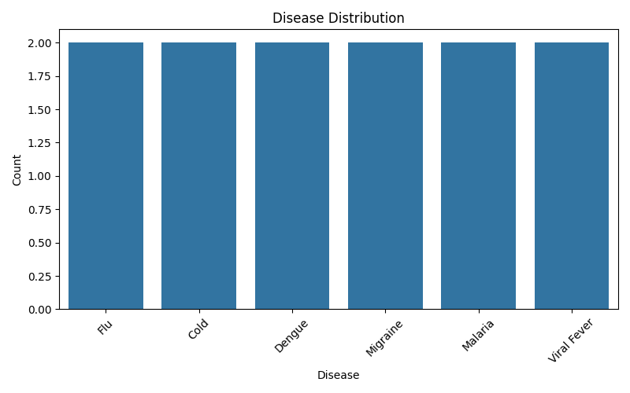
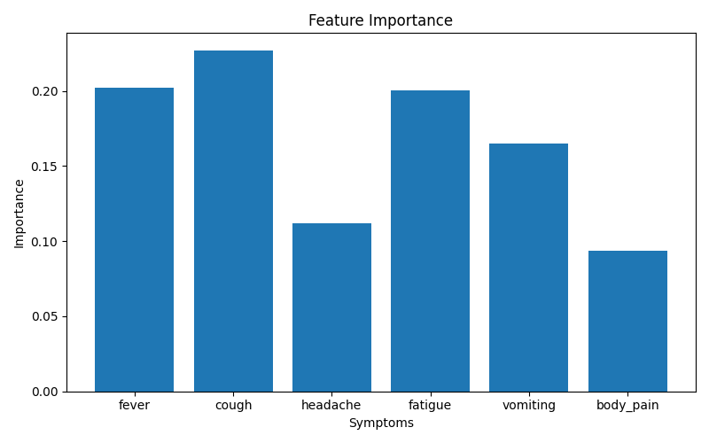
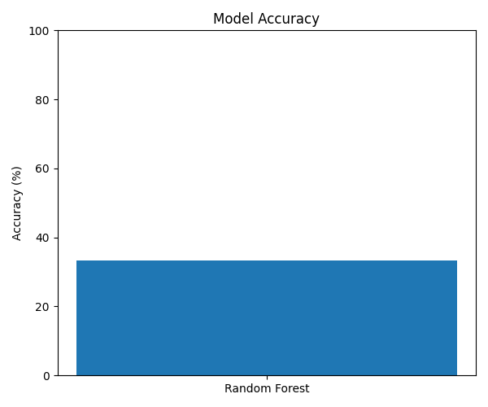

# Disease Prediction System using Machine Learning

## Overview

This project is a Machine Learning-based Disease Prediction System that predicts diseases based on user symptoms. The system uses Decision Tree and Random Forest algorithms to analyze symptom data and provide accurate disease predictions.

---

## Features

* Predicts diseases from symptoms
* Uses Machine Learning algorithms
* Random Forest and Decision Tree models
* Model accuracy evaluation
* Feature importance analysis
* Data visualization charts

---

## Technologies Used

* Python
* Pandas
* NumPy
* Scikit-learn
* Matplotlib
* Seaborn

---

## Machine Learning Algorithms

* Decision Tree Classifier
* Random Forest Classifier

---

## Project Structure

```plaintext
Disease-Prediction-System-ML/
│
├── disease_prediction.py
├── dataset.csv
├── requirements.txt
├── README.md
├── .gitignore
├── LICENSE
├── disease_distribution.png
├── feature_importance.png
└── accuracy_chart.png
```

---

## Installation

Install required libraries:

```bash
pip install -r requirements.txt
```

---

## Run the Project

```bash
python disease_prediction.py
```

---

## Sample Input

```plaintext
Fever: 1
Cough: 1
Headache: 1
Fatigue: 1
Vomiting: 0
Body Pain: 1
```

---

## Sample Output

```plaintext
Predicted Disease: Malaria
```

---

## Generated Charts

* Disease Distribution Chart
* Feature Importance Chart
* Model Accuracy Chart

---

## Future Improvements

* Flask web application
* Real healthcare dataset integration
* Doctor recommendation system
* Voice-based symptom input
* AI chatbot integration

---

## Resume Description

Developed a Machine Learning-based Disease Prediction System using Decision Tree and Random Forest algorithms to predict diseases from symptoms. Implemented data preprocessing, model training, accuracy evaluation, and data visualization using Python and Scikit-learn.

---

## Author

Mandar Gade

---

## License

This project is licensed under the MIT License.

## Project Screenshots






